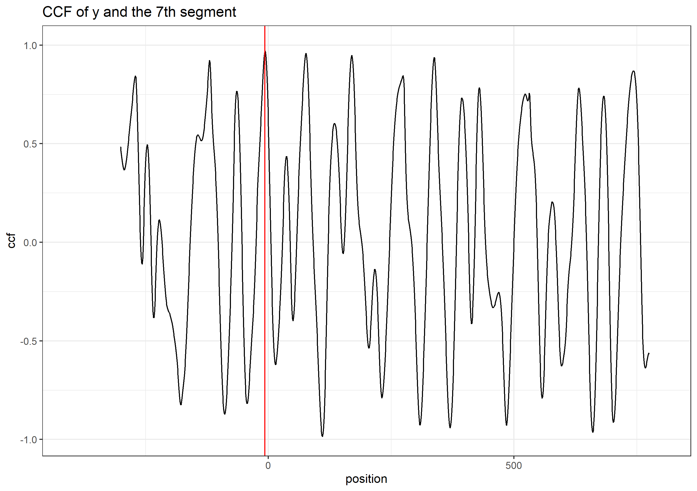

<!-- README.md is generated from README.Rmd. Please edit that file -->

```{r, include = FALSE}
knitr::opts_chunk$set(
  collapse = TRUE,
  comment = "#>",
  fig.path = "man/figures/README-",
  out.width = "80%",
  echo=FALSE
)
```

# CMPS

<!-- badges: start -->
<!-- badges: end -->

The CMPS package is an implementation of the Congruent Matching Profile Segments (CMPS) method [@Chen:2019ji]. In general, it can be used for objective comparison of striated tool marks, but in our examples, we mainly use it for bullet profiles/signatures comparison. The CMPS number is expected to be large if two signatures are similar. So it can also be considered as a feature that measures the similarity of two bullets.

## Installation

You can install the released version of CMPS from [CRAN](https://CRAN.R-project.org) with:

``` r
install.packages("CMPS")
```

And the development version from [GitHub](https://github.com/) with:

``` r
# install.packages("devtools")
devtools::install_github("willju-wangqian/CMPS")
```

## Example and Summary of the Algorithm

In this section we use a known match (KM) compasison to illustrate the main ideas of CMPS algorithm. The bullet data used here can be found in Chapter 3.5 of [Open Forensic Science in R](https://sctyner.github.io/OpenForSciR/bullets.html#case-study-1).

We can also run the following chunk. In this example, we are taking the signature of the third land engraved area (LEA) of the second bullet as the reference signature and the second LEA of the first bullet as the comparison signature. This is a KM comparison. 

```{r eval=FALSE, echo=TRUE}
library(CMPS)

data("bullets")
land23 <- bullets$sigs[bullets$bulletland == "2-3"][[1]]
land12 <- bullets$sigs[bullets$bulletland == "1-2"][[1]]

x <- land23$sig
y <- land12$sig

cmps <- extract_feature_cmps(x, y, full_result = TRUE)
cmps

# $CMPS.score
# [1] 14
# 
# $rec.position
# [1] -5
# 
# $pos.df
#   position cmps
# 1       -9   14
# 2       -8   14
# 3       -7   14
# 4       -6   14
# 5       -5   14
# 6       -4   14
# 7       -3   14
# 8       -2   14
# 9       -1   14
# 
# $nseg
# [1] 22

```

And we have the plot of `x` and `y`.

```{r, fig.cap="A KM Comparison, x and y", out.width="80%", fig.keep="hold", fig.align='center'}
knitr::include_graphics("man/figures/step0.png")
```


#### Main Idea

The main idea of the CMPS method is that: 

1. we take the first signature as the reference signature (`x`) and cut it into consecutive and non-overlapping basis segments of the same length. In this case, we set the length of a basis segment to be 50 units, and we have 22 basis segments in total.

```{r, fig.cap="Cut x into consecutive and non-overlapping basis segments of the same length. Only 4 basis segments are shown here", out.width="80%", fig.keep="hold", fig.align='center'}
knitr::include_graphics("man/figures/step1_1.png")
```


2. for each basis segment, we compute the cross-correlation function (ccf) between the basis segment and the comparison signature (`y`)

```{r, fig.cap="y and 7th basis segment", out.width="80%", fig.keep="hold", fig.align='center'}
knitr::include_graphics("man/figures/step2_1.png")
```

```{r, fig.cap="the cross-correlation function (ccf) between y and segment 7", out.width="80%", fig.keep="hold", fig.align='center'}

```

* for the `ccf` curve, the `position` represents the shift of the segment. A negative value means a shift to the left, a positive value means a shift to the right, and 0 means no shift (the segment stays at its original position in the reference signature);
* we are interested in the peaks in the ccf curve and the positions of those peaks (as indicated by the red vertical line in the plot above). In other words, if we shift the segment, which position would give us the "best fit"?

3. If two signatures are similar (a KM comparison), most of the basis segments should agree with each other on the position of the best fit. Then these segments are called the "**Congruent Matching Profile Segments**".

```{r, fig.cap="compare y to the basis segments of x", out.width="80%", fig.keep="hold", fig.align='center'}
knitr::include_graphics(c("man/figures/step1_2.png"))
```

  And ideally, if two signatures are identical, we are expecting the position of the highest peak in the ccf curve remains the same across all ccf curves (we only show 7 segments here);

```{r, fig.cap="ideal case: compare x to itself. The highest peak has value 1 and is marked by the blue dot", out.width="80%", fig.keep="hold", fig.align='center'}
knitr::include_graphics(c("man/figures/step3_1.png"))
```

  But in the real case, the basis segments might not achieve a final agreement, but we have the majority; 

```{r, fig.cap="real case: compare x to y. The 5 highest peaks are marked by the blue dots", out.width="80%", fig.keep="hold", fig.align='center'}
knitr::include_graphics(c("man/figures/step3_2.png"))
```

  We mark the 5 highest peaks for each ccf curve because the position of the "highest peak" might not be the best one. 

4. each ccf curve votes for 5 candidate positions, then we ask two questions in order to obtain the CMPS number/score:

* which position receives the most votes? -> the best position (indicated by the red vertical line)

* how many segments have voted for the best position? -> CMPS number

  If we focus on these 7 segments only, and have a very short tolerance zone, the CMPS number is 6.
  
  (If we consider all 22 segments, and have a default tolerance zone (+/- 25 units), the CMPS number is 20.)

5. false positive: how can the segments vote more wisely? -> Multi Segment Lengths Strategy

* by increasing the segment length (scale), one can reduce the number of "false positive" peaks

```{r, fig.cap="Multi Segment Lengths Strategy - increasing the segment length could decrease the number of false positive peaks in ccf curves", out.width="80%", fig.keep="hold", fig.align='center'}
knitr::include_graphics(c("man/figures/step5_1.png",
                   "man/figures/step5_2.png"))
```

* we choose 5 peaks at scale 1; 3 peaks at scale 2; 1 peak at scale 3

  the peak shared by all three scales is a **consistent correlation peak** (ccp). And the position of the ccp is our best choice. Sometimes a ccp might not be found. 
  Trying to identify a ccp for each basis segment is called a "multi segment lengths" strategy.
  
* and then, each ccf curve votes for only 1 best condidate position if a ccp can be found; again, we ask two quesitons:
    + which position receives the most votes?
    + how many segments have voted for this position? -> CMPS number
    
* by default, CMPS algorithm uses the multi-segment lengths strategy. 

6. if we consider all segments and use the multi-segment lengths strategy

* when comparing x and y, a KM comparison, we have 

```{r, echo=TRUE, eval=FALSE}
extract_feature_cmps(x, y, seg_length = 50, seg_scale_max = 3, Tx = 25, 
                     npeaks.set = c(5, 3, 1), full_result = TRUE)

# $CMPS.score
# [1] 14
# 
# $rec.position
# [1] -5
# 
# $pos.df
#   position cmps
# 1       -9   14
# 2       -8   14
# 3       -7   14
# 4       -6   14
# 5       -5   14
# 6       -4   14
# 7       -3   14
# 8       -2   14
# 9       -1   14
# 
# $nseg
# [1] 22
```

* if we have a KNM (known non-match) comparison, e.g. compare land 2-3 with land 1-3:

```{r, eval=FALSE, echo=TRUE}
land23 <- bullets$sigs[bullets$bulletland == "2-3"][[1]]
land13 <- bullets$sigs[bullets$bulletland == "1-3"][[1]]

result <- extract_feature_cmps(land23$sig, land13$sig, seg_length = 50, seg_scale_max = 3, Tx = 25, 
                     npeaks.set = c(5, 3, 1), full_result = TRUE)
result$CMPS.score
# [1] 1

result$rec.position
# [1] 128

result$nseg
# [1] 22
```

#### Full Comparison Between Two Bullets

`extract_feature_cmps()` can also be used in a pipeline fashion

```{r eval = FALSE, echo=TRUE}
library(tidyverse)
library(bulletxtrctr)

lands <- unique(bullets$bulletland)

comparisons <- data.frame(expand.grid(land1 = lands[1:6], land2 = lands[7:12]), 
                          stringsAsFactors = FALSE)

comparisons <- comparisons %>% mutate(
  aligned = purrr::map2(.x = land1, .y = land2, 
                        .f = function(xx, yy) {
                          land1 <- bullets$sigs[bullets$bulletland == xx][[1]]
                          land2 <- bullets$sigs[bullets$bulletland == yy][[1]]
                          land1$bullet <- "first-land"
                          land2$bullet <- "second-land"
                          
                          sig_align(land1$sig, land2$sig)
                        }))

comparisons <- comparisons %>% 
  mutate(cmps = aligned %>% purrr::map(.f = function(a) {
    extract_feature_cmps(a$lands$sig1, a$lands$sig2, full_result = TRUE)
  }))

# comparisons.cmps <- comparisons.cmps %>% 
#   mutate(cmps = aligned %>% purrr::map_dbl(.f = function(a) {
#     extract_feature_cmps(a$lands$sig1, a$lands$sig2, full_result = FALSE)
#   }))
# comparisons.cmps %>% select(land1, land2, cmps) 

comparisons <- comparisons %>% 
  mutate(
    cmps_score = sapply(comparisons$cmps, function(x) x$CMPS.score),
    cmps_nseg = sapply(comparisons$cmps, function(x) x$nseg)
  )

cp1 <- comparisons %>% select(land1, land2, cmps_score, cmps_nseg)
cp1

#    land1 land2 cmps_score cmps_nseg
# 1    1-1   2-1          2        23
# 2    1-2   2-1          2        22
# 3    1-3   2-1          1        21
# 4    1-4   2-1          2        22
# 5    1-5   2-1          1        23
# 6    1-6   2-1         14        22
# 7    1-1   2-2          5        23
# 8    1-2   2-2          2        22
# 9    1-3   2-2          1        21
# 10   1-4   2-2          1        22
# 11   1-5   2-2          2        23
# 12   1-6   2-2          2        22
# 13   1-1   2-3          3        23
# 14   1-2   2-3         13        22
# 15   1-3   2-3          2        21
# 16   1-4   2-3          1        22
# 17   1-5   2-3          1        23
# 18   1-6   2-3          2        22
# 19   1-1   2-4          4        23
# 20   1-2   2-4          1        22
# 21   1-3   2-4         11        21
# 22   1-4   2-4          1        22
# 23   1-5   2-4          2        23
# 24   1-6   2-4          2        22
# 25   1-1   2-5          3        23
# 26   1-2   2-5          1        22
# 27   1-3   2-5          2        21
# 28   1-4   2-5         10        22
# 29   1-5   2-5          2        23
# 30   1-6   2-5          1        22
# 31   1-1   2-6          2        23
# 32   1-2   2-6          1        22
# 33   1-3   2-6          2        21
# 34   1-4   2-6          1        22
# 35   1-5   2-6         15        23
# 36   1-6   2-6          1        22
```


## Future Work

* improve and manage to submit the CMPS package to CRAN

* cross-validate some hyper-parameters

* apply CMPS to 
    + the dataset used in the paper to see if we can reproduce their results
    + other datasets

# Reference


