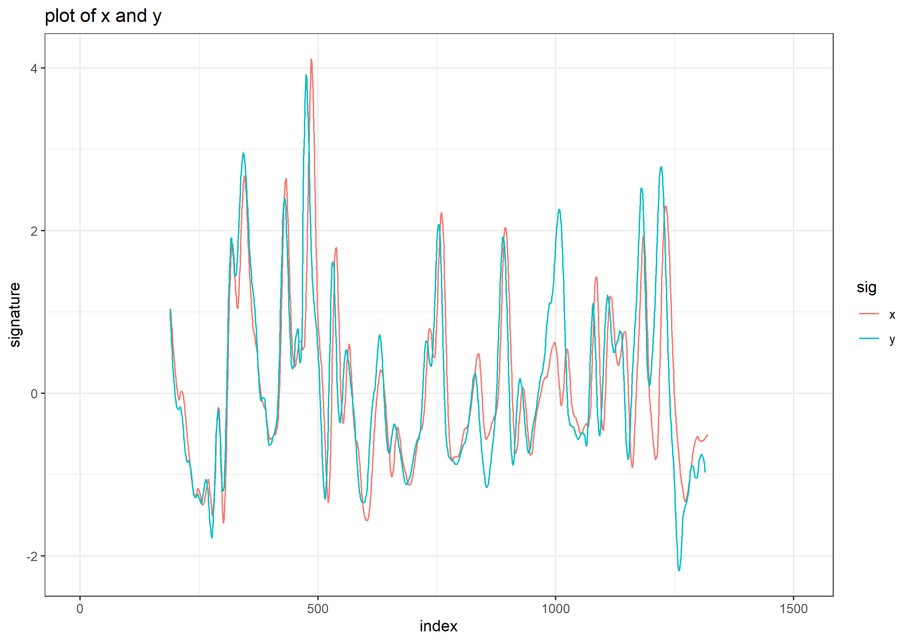
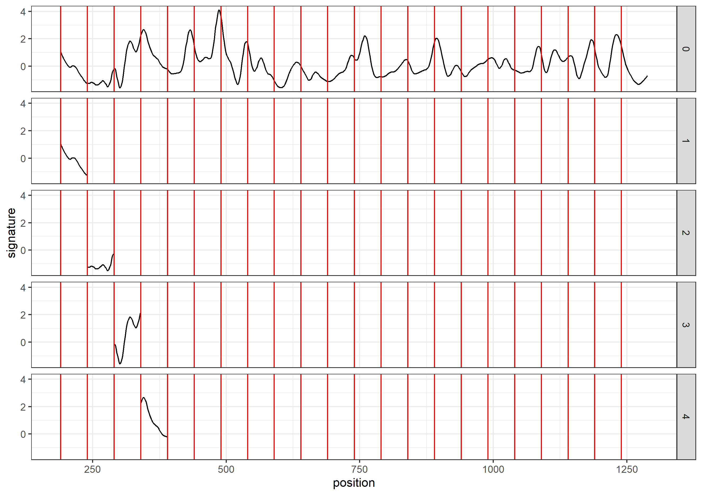
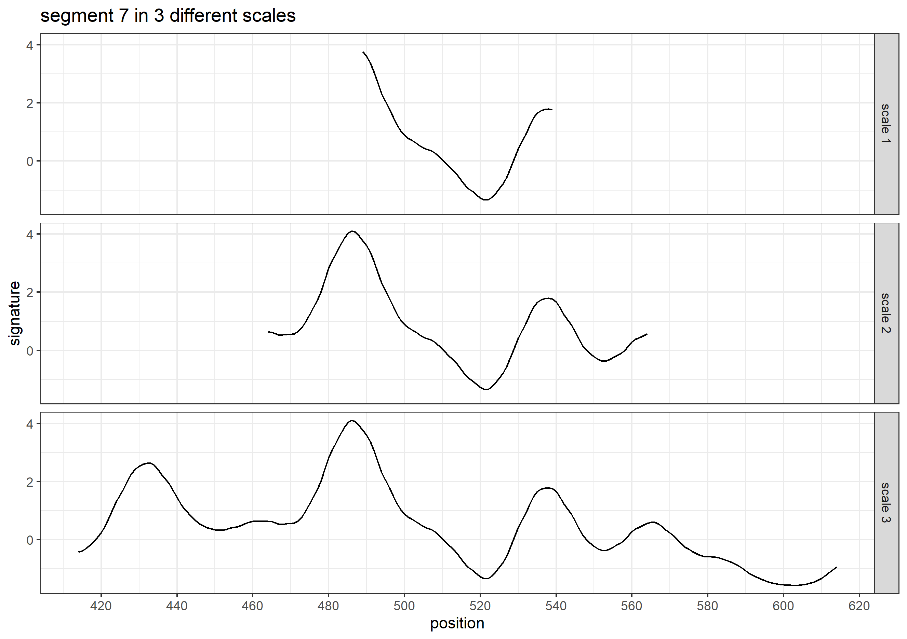

<!-- README.md is generated from README.Rmd. Please edit that file -->

```{r, include = FALSE}
knitr::opts_chunk$set(
  collapse = TRUE,
  comment = "#>",
  fig.path = "man/figures/README-",
  out.width = "100%"
)
```

# CMPS

<!-- badges: start -->
<!-- badges: end -->

The CMPS package is an implementation of the Congruent Matching Profile Segments (CMPS) method [cite?]. In general, it can be used for objective comparison of striated tool marks, but in our examples, we mainly use it for bullet profiles/signatures comparison. The CMPS number is expected to be large if two signatures are similar. So it can also be considered as a feature that measures the similarity of two bullets.

## Installation

You can install the released version of CMPS from [CRAN](https://CRAN.R-project.org) with:

``` r
install.packages("CMPS")
```

And the development version from [GitHub](https://github.com/) with:

``` r
# install.packages("devtools")
devtools::install_github("willju-wangqian/CMPS")
```

## Example

This is a basic example which shows you how to compute the CMPS number of a comparison between two bullet signatures.

In this example, we are taking the signature of the third land engraved area (LEA) of the second bullet as the reference signature and the second LEA of the first bullet as the comparison signature. This is a KM comparison.

```{r}
library(CMPS)

data("bullets")
land23 <- bullets$sigs[bullets$bulletland == "2-3"][[1]]
land12 <- bullets$sigs[bullets$bulletland == "1-2"][[1]]

x <- land23$sig
y <- land12$sig

cmps <- extract_feature_cmps(x, y, full_result = T)
cmps
```

```{r echo = FALSE, include=FALSE}
devtools::session_info()
```

Plot of x and y

```{r , echo=FALSE, out.width = '100%'}

```


## Main Idea

The main idea of the CMPS method is that: 

1. we take the first signature as the reference signature (`x`) and cut it into consecutive and non-overlapping basis segments of the same length. In this case, we have 22 basis segments in total.

```{r , echo=FALSE, out.width = '80%'}

```


2. for each basis segment, we compute the cross-correlation function (ccf) between the basis segment and the comparison signature (`y`)


```{r , echo=FALSE, out.width = '80%'}
knitr::include_graphics("image/step2_1.png")
knitr::include_graphics("image/step2_2.png")
```

* for the `ccf` curve, the `position` represents the shift of the segment. A negative value means a shift to the left, and a positive value means a shift to the right;
* we are interested in the peaks in the ccf curve and the positions of those peaks (as indicated by the red vertical line in the plot above). In other words, if we shift the segment, which position would give us the "best fit"?


3. ideally, if two signatures are identical, we are expecting the position of the highest peak in the ccf curve remains the same across all ccf curves;

* ideal case: compare `x` to itself. The highest peak has value 1 and is marked by the blue dot.

```{r , echo=FALSE, out.width = '80%'}
knitr::include_graphics("image/step3_1.png")
```

* real case: compare `x` to `y`. We mark the 5 highest peaks for each ccf curve.

```{r , echo=FALSE, out.width = '80%'}
knitr::include_graphics("image/step3_2.png")
```


4. each ccf curve votes for 5 candidate positions, then we ask two questions:

* which position receives the most votes? -> the best position (indicated by the red vertical line)

* how many segments have voted for the best position? -> CMPS number

  If we focus on these 7 segments only, the CMPS number is 6.

5. how can the segment vote more wisely?

* by increasing the segment length (scale), one can reduce the number of "false positive" peaks

```{r , echo=FALSE, out.width = '80%'}

knitr::include_graphics("image/step5_2.png")
```

* we choose 5 peaks at scale 1; 3 peaks at scale 2; 1 peak at scale 3

  the peak shared by all three scales is a consistent correlation peak (ccp). And the position of the ccp is our best choice. This is called a "multi segment lengths" strategy.
  
* and then, each ccf curve votes for only 1 best condidate position if a ccp can be found; again, we ask two quesitons:
    + which position receives the most votes?
    + how many segments have voted for this position? -> CMPS number

* if we consider all segments when comparing x and y, a KM comparison

```{r}
extract_feature_cmps(x, y, seg_length = 50, seg_scale_max = 3, Tx = 25, 
                     npeaks.set = c(5, 3, 1), full_result = T)
```


