<!-- README.md is generated from README.Rmd. Please edit that file -->

# cmpsR

<!-- badges: start -->

[](https://github.com/willju-wangqian/cmpsR/actions)
<!-- badges: end -->

The `cmpsR` package is an implementation of the Congruent Matching
Profile Segments (CMPS) method (Chen et al. 2019). In general, it can be
used for objective comparison of striated tool marks, but in our
examples, we mainly use it for bullet signatures comparison. The CMPS
score is expected to be large if two signatures are similar. So it can
also be considered as a feature that measures the similarity of two
bullet signatures.

## Installation

You can install the released version of cmpsR from
[CRAN](https://CRAN.R-project.org) with:

``` r
install.packages("cmpsR")
```

And the development version from [GitHub](https://github.com/) with:

``` r
# install.packages("devtools")
devtools::install_github("willju-wangqian/cmpsR")
```

## Example and Summary of the Algorithm

In this section we use a known match (KM) compasison (of two bullets) to
illustrate the main ideas of CMPS algorithm and to showcase the `cmpsR`
implementation. The `cmpsR` package includes a simple data set of 12
bullet signatures generated from two bullets (each bullet has 6 bullet
signatures). These bullet data come from the James Hamby Consecutively
Rifled Ruger Barrel Study (Brundage 1998; Hamby, Brundage, and Thorpe
2009; Hamby et al. 2019), and the two bullets included in `cmpsR` are
just a subset of Hamby set 252. These bullet data in their original
format can also be found in Chapter 3.5 of [Open Forensic Science in
R](https://sctyner.github.io/OpenForSciR/bullets.html#case-study-1).

A comparison of two bullets is considered as a match if two bullets are
fired from the same barrel (come from the same source). The gun barrel
used in the Hamby study has 6 lands, and during the firing process
striation marks will be engraved on the bullet by these lands. A bullet
signature is a numerical representation of the striation marks engraved
by a land. This is why each bullet can generate 6 bullet signatures. Two
bullet signatures are a match if they are originally engraved by the
same land in a gun barrel. Therefore, two bullets of a known-match
comparison will have 36 pairwise bullet signature comparisons, and 6 of
them are matching bullet signature comparisons while 30 of them are
non-matching bullet signature comparisons.

Here we plot the twelve bullet signatures of the two bullets. The bullet
signatures are aligned so that the top figure and the bottom figure of
the same column are a matching bullet signature comparison.

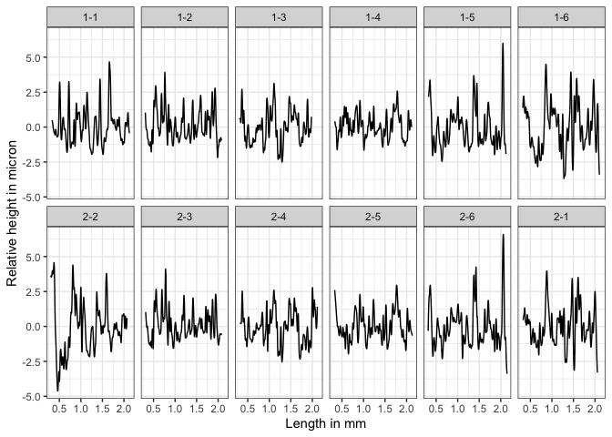

To further illustrate the idea of the CMPS algorithm, let’s consider one
matching bullet signature comparison: bullet signature of bullet 1 land
2 and bullet signature of bullet 2 land 3 (the second column), and
compute the CMPS score of this comparison:

``` r
library(cmpsR)
data("bullets")

x <- bullets$sigs[bullets$bulletland == "2-3"][[1]]$sig
y <- bullets$sigs[bullets$bulletland == "1-2"][[1]]$sig

cmps <- extract_feature_cmps(x, y, include = "full_result")
cmps$CMPS_score
#> [1] 18
```

And we have the plot of `x` and `y`.

<div class="figure" style="text-align: center">

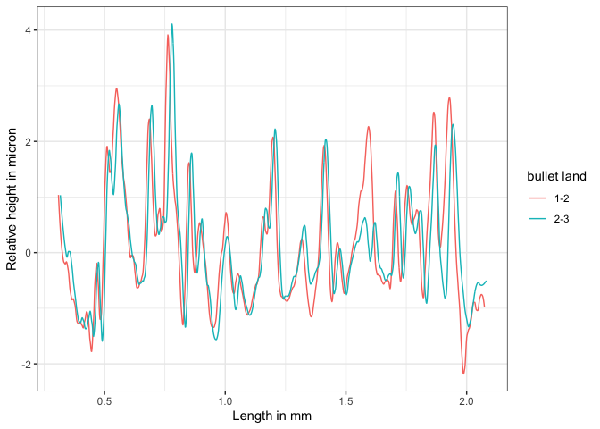
<p class="caption">
A KM Comparison, x and y
</p>

</div>

#### Main Idea

The main idea of the CMPS method is that:

1.  we take the first signature as the comparison signature (`x` or
    bullet signature of “2-3”) and cut it into consecutive and
    non-overlapping basis segments of the same length. In this case, we
    set the length of a basis segment to be 50 units, and we have 22
    basis segments in total for bullet signature `x`.

<div class="figure" style="text-align: center">

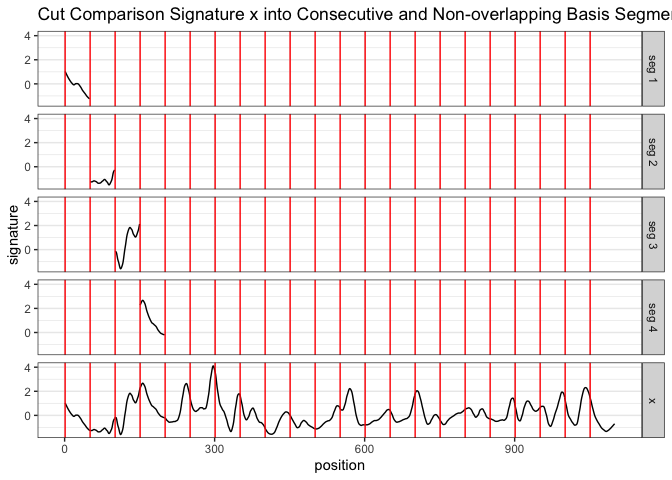
<p class="caption">
Cut x into consecutive and non-overlapping basis segments of the same
length. Only 4 basis segments are shown here
</p>

</div>

2.  for each basis segment, we compute the cross-correlation function
    (ccf) between the basis segment and the reference signature (`y` or
    bullet signature of “1-2”)

<div class="figure" style="text-align: center">

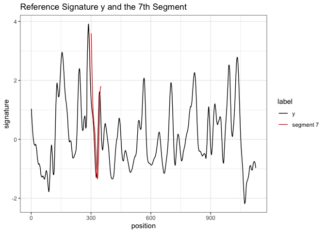
<p class="caption">
y and 7th basis segment
</p>

</div>

<div class="figure" style="text-align: center">

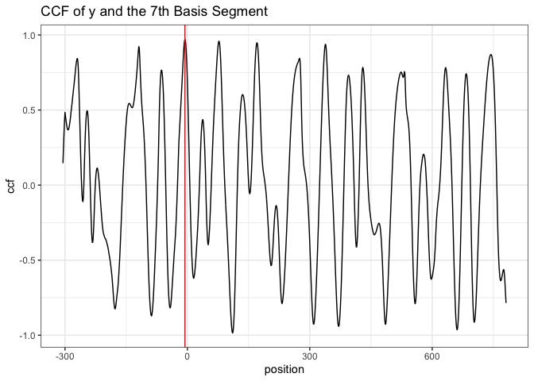
<p class="caption">
the cross-correlation function (ccf) between y and segment 7
</p>

</div>

-   for the `ccf` curve, the `position` represents the shift of the
    segment. A negative value means a shift to the left, a positive
    value means a shift to the right, and 0 means no shift (the segment
    stays at its original position in the reference signature);
-   we are interested in the peaks in the ccf curve and the positions of
    those peaks (as indicated by the red vertical line in the plot
    above). In other words, if we shift the segment, which position
    would give us the “best fit?”

3.  If two signatures are from a KM comparison, most of the basis
    segments should agree with each other on the position of the best
    fit. Then these segments are called the “**Congruent Matching
    Profile Segments (CMPS)**.”

Ideally, if two signatures are identical, we are expecting the position
of the highest peak in the ccf curve remains the same across all ccf
curves (we only show 7 segments here);

<div class="figure" style="text-align: center">

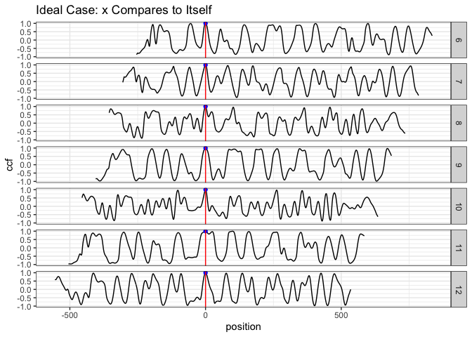
<p class="caption">
ideal case: compare x to itself. The highest peak has value 1 and is
marked by the blue dot
</p>

</div>

But in the real case, the basis segments might not achieve a final
agreement, but we have the majority;

<div class="figure" style="text-align: center">

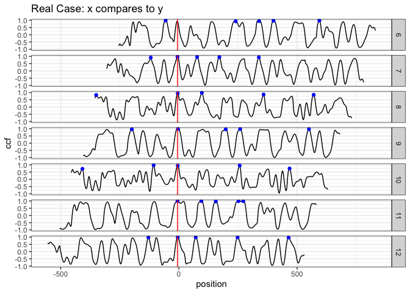
<p class="caption">
real case: compare x to y. The 5 highest peaks are marked by the blue
dots
</p>

</div>

We mark the 5 highest peaks for each ccf curve because the position of
the “highest peak” might not be the best one.

4.  each ccf curve votes for 5 candidate positions, then we ask two
    questions in order to obtain the CMPS number/score:

-   which position receives the most votes? -&gt; the best position
    (indicated by the red vertical line)

-   how many segments have voted for the best position? -&gt; CMPS score

    If we focus on these 7 segments only, and have a very short
    tolerance zone, the CMPS number is 6.

    (If we consider all 22 segments, and have a default tolerance zone
    (+/- 25 units), the CMPS number is 20.)

5.  false positive: how can the segments vote more wisely? -&gt; Multi
    Segment Lengths Strategy

-   by increasing the segment length, one can reduce the number of
    “false positive” peaks.

-   the first scale level is the original length of segment 7; for the
    second scale level, we double its length while keeping its center.
    That is, we include 25 more units from both the left and right side
    of the segment 7 to obtain a segment of 100 units length. For the
    third scale level, we double the segment length again to obtain a
    segment of length 200.

<div class="figure" style="text-align: center">

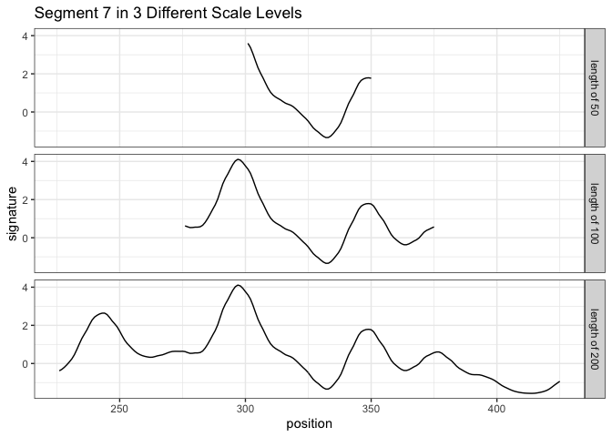
<p class="caption">
Multi Segment Lengths Strategy - increasing the segment length could
decrease the number of false positive peaks in ccf curves
</p>

</div>

<div class="figure" style="text-align: center">

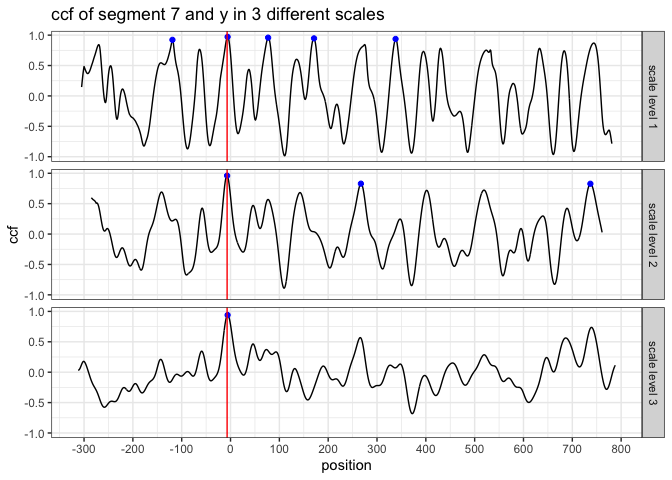
<p class="caption">
Multi Segment Lengths Strategy - increasing the segment length could
decrease the number of false positive peaks in ccf curves
</p>

</div>

-   we choose five peaks at scale level 1; three peaks at scale level 2;
    one peak at scale level 3

    the peak shared by all three scale levels is a **consistent
    correlation peak** (ccp). And the position of the ccp is our best
    choice. Sometimes a ccp might not be found. Trying to identify a ccp
    for each basis segment is called a “multi segment lengths” strategy.

    The following plots (generated by `cmpsR::cmps_segment_plot`)
    summarize the information of the two above plots. It shows that
    segment 7 finds a consistent correlation peak (ccp) at a position
    near 0 (position `-6`).

    ``` r
    cmps <- extract_feature_cmps(x, y, include = "full_result")
    cmps_plot_list <- cmpsR::cmps_segment_plot(cmps, seg_idx = 7)
    ggpubr::ggarrange(plotlist = unlist(cmps_plot_list, recursive = FALSE),
                      nrow = 3, ncol = 2)
    ```

    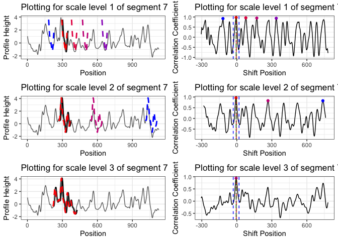

-   In this case, since segment 7 identifies a ccp, it casts a vote for
    position `-6`. Then we ask two questions:

    -   which position receives the most votes (within a tolerance zone
        specified by `Tx`)?
    -   how many segments have voted for this position? -&gt; CMPS score

-   by default, CMPS algorithm uses the multi-segment lengths strategy.
    Use `?cmpsR::extract_feature_cmps` to learn more about the function,
    including its default settings.

6.  If we follow the procedure described above (using the multi-segment
    lengths strategy) and investigate all 22 basis segments, we can find
    that 18 of them have cast a vote for position `0`  ± 25 (since
    `Tx = 25` by default). Therefore, for this KM bullet signature
    comparison, the CMPS score is 18.

``` r
cmps <- extract_feature_cmps(x, y, seg_length = 50, Tx = 25, 
                     npeaks_set = c(5, 3, 1), include = "full_result")
cmps$CMPS_score
#> [1] 18
```

-   Segment 6 doesn’t cast a vote. Take a look at the following plot to
    find out why.

    ``` r
    cmps_plot_list <- cmpsR::cmps_segment_plot(cmps, seg_idx = 6)
    ggpubr::ggarrange(plotlist = unlist(cmps_plot_list, recursive = FALSE),
                      nrow = 3, ncol = 2)
    ```

    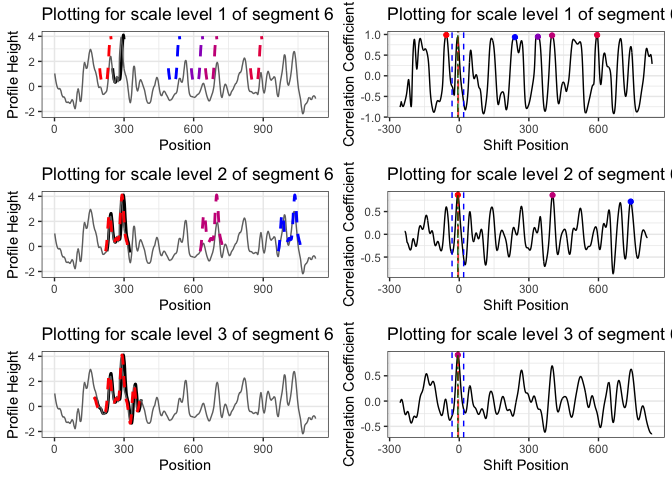

    It doesn’t identify a consistent correlation peak.

7.  If we have a KNM (known non-match) comparison, e.g. compare bullet
    signature 2-3 with 1-3:

``` r
land23 <- bullets$sigs[bullets$bulletland == "2-3"][[1]]
land13 <- bullets$sigs[bullets$bulletland == "1-3"][[1]]

cmps_knm <- extract_feature_cmps(land23$sig, land13$sig, seg_length = 50, Tx = 25, 
                     npeaks_set = c(5, 3, 1), include="full_result")
cmps_knm$CMPS_score
#> [1] 2
```

#### Full Comparison Between Two Bullets

`extract_feature_cmps()` can also be used in a pipeline fashion. The
following code performs a full comparison of two bullets. That is, it
evaluates all 36 pairwise bullet signature comparisons and computes the
CMPS scores.

``` r
library(tidyverse)
library(cmpsR)

data("bullets")

lands <- unique(bullets$bulletland)

comparisons <- data.frame(expand.grid(land1 = lands[1:6], land2 = lands[7:12]),
                          stringsAsFactors = FALSE)

comparisons <- comparisons %>%
  left_join(bullets %>% select(bulletland, sig1=sigs),
            by = c("land1" = "bulletland")) %>%
  left_join(bullets %>% select(bulletland, sig2=sigs),
            by = c("land2" = "bulletland"))

comparisons <- comparisons %>% mutate(
  cmps = purrr::map2(sig1, sig2, .f = function(x, y) {
    extract_feature_cmps(x$sig, y$sig, include = "full_result")
  })
)

comparisons <- comparisons %>%
  mutate(
    cmps_score = sapply(comparisons$cmps, function(x) x$CMPS_score),
    cmps_nseg = sapply(comparisons$cmps, function(x) x$nseg)
  )
  
cp1 <- comparisons %>% select(land1, land2, cmps_score, cmps_nseg)
cp1  
#>    land1 land2 cmps_score cmps_nseg
#> 1    1-1   2-1          2        23
#> 2    1-2   2-1          2        22
#> 3    1-3   2-1          1        21
#> 4    1-4   2-1          2        22
#> 5    1-5   2-1          2        23
#> 6    1-6   2-1         16        22
#> 7    1-1   2-2          3        23
#> 8    1-2   2-2          1        22
#> 9    1-3   2-2          1        21
#> 10   1-4   2-2          1        22
#> 11   1-5   2-2          2        23
#> 12   1-6   2-2          3        22
#> 13   1-1   2-3          2        23
#> 14   1-2   2-3         17        22
#> 15   1-3   2-3          3        21
#> 16   1-4   2-3          1        22
#> 17   1-5   2-3          1        23
#> 18   1-6   2-3          1        22
#> 19   1-1   2-4          2        23
#> 20   1-2   2-4          1        22
#> 21   1-3   2-4         14        21
#> 22   1-4   2-4          1        22
#> 23   1-5   2-4          1        23
#> 24   1-6   2-4          2        22
#> 25   1-1   2-5          1        23
#> 26   1-2   2-5          2        22
#> 27   1-3   2-5          1        21
#> 28   1-4   2-5         10        22
#> 29   1-5   2-5          1        23
#> 30   1-6   2-5          1        22
#> 31   1-1   2-6          2        23
#> 32   1-2   2-6          3        22
#> 33   1-3   2-6          1        21
#> 34   1-4   2-6          1        22
#> 35   1-5   2-6         15        23
#> 36   1-6   2-6          1        22
```

The following plot summarizes the CMPS scores computed above.

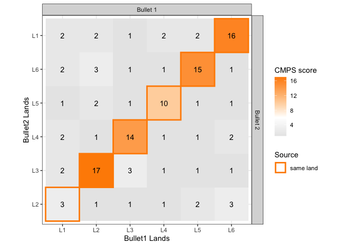

## Reference

<div id="refs" class="references csl-bib-body hanging-indent">

<div id="ref-brundage" class="csl-entry">

Brundage, David J. 1998. “<span class="nocase">The Identification of
Consecutively Rifled Gun Barrels</span>.” *AFTE Journal* 30 (3): 438–44.

</div>

<div id="ref-Chen:2019ji" class="csl-entry">

Chen, Zhe, Wei Chu, Johannes A Soons, Robert M Thompson, John Song, and
Xuezeng Zhao. 2019. “<span class="nocase">Fired Bullet Signature
Correlation Using the Congruent Matching Profile Segments (CMPS)
Method</span>.” *Forensic Science International*, December, \#109964.
<https://doi.org/10.1016/j.forsciint.2019.109964>.

</div>

<div id="ref-Hamby:2019" class="csl-entry">

Hamby, James E., David J. Brundage, Nicholas D. K. Petraco, and James W.
Thorpe. 2019. “A Worldwide Study of Bullets Fired From 10 Consecutively
Rifled 9mm RUGER Pistol Barrels—Analysis of Examiner Error Rate.”
*Journal of Forensic Sciences* 64 (2): 551–57.
<https://doi.org/10.1111/1556-4029.13916>.

</div>

<div id="ref-hamby" class="csl-entry">

Hamby, James E., David J. Brundage, and James W. Thorpe. 2009. “<span
class="nocase">The Identification of Bullets Fired from 10 Consecutively
Rifled 9mm Ruger Pistol Barrels: A Research Project Involving 507
Participants from 20 Countries</span>.” *AFTE Journal* 41 (2): 99–110.

</div>

</div>
